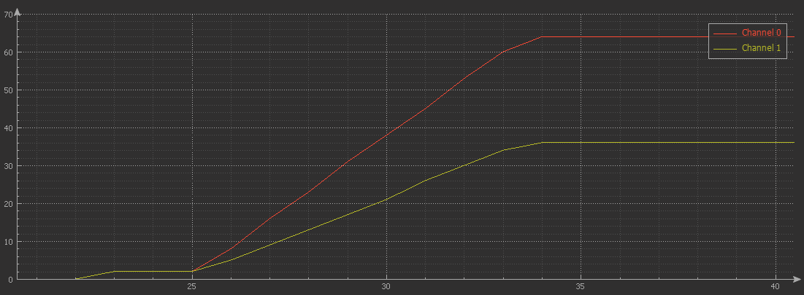

# Button Debounce Filter
Microcontroller GPIO button interface library.

[Library files]
 
# Concept block 

```
                          _______________________
Expected switch  ________|                       |___________________
               
                               __________________ 
Actual switch    ________||||||                  ||||||___________
                         <---->                  <---->
                             ^----Button glitches---^ 
                           ______________________
Debounce Delay   _________|                      |___________________
applied
                                _______________________
Filter On-Off    ______________|                       |_____________
Delay Applied             <---->                  <---->
                   On delay-^              Off delay-^
                   
Filter delay used for noise remove
                                              ______ _____
signal           ______|__________ _|________|      |     |________
                 Noise-^------------^---------------^
                        ___         ___       ______     _
Debounce delay   ______|   |_______|   |_____|      |___| |________ NOT OK
signal
                                                 ____________
filtered delay   _______________________________|            |______ OK
signal

Debounce delay + Filter delay
```

# Code usage

## Debounce

```c
/* Include library */
#include "button.h"

/* button objects */
button_t btn;

void main()
{
   /* GPIO system initialization */
   User_Gpio_Init();

   /* Initialization of debounce filters */
   button_create(&btn, (uint32_t *)&GPIOB->IDR, GPIO_PIN_4, active_low); 
  
   /* Eliminate delay filter for debounce test */
   button_filter(&btn, 0, 0);

   while(1)
   {
      orgState = !(GPIOB->IDR & GPIO_PIN_4); /* Active low logic */
      debounceState = button_read(&btn);

      if (orgState != last_orgState)
      {
         last_orgState = orgState;
         orgCount++;
      }
    
      if (debounceState != last_debounceState)
      {
         last_debounceState = debounceState;
         debounceCount++;
      }
    
      if (HAL_GetTick() - print_time > 2000)
      {
         print_time = HAL_GetTick();
         printf("$%d %d;", orgCount, debounceCount);
      }

   }
}

```
Output:

Time(Sec) | orgCount | debounceCount
:---:     |:---:     |:---:
0         |0         | 0
2         |2         | 2
4         |2         | 2
8         |2         | 2
10        |8         | 5
12        |16        | 9
14        |23        | 13
16        |31        | 17
18        |38        | 21
20        |45        | 26
22        |53        | 30
24        |60        | 34
26        |64        | 36
28        |64        | 36

   + channel 0 - orgCount
   + channel 1 - debounceCount


